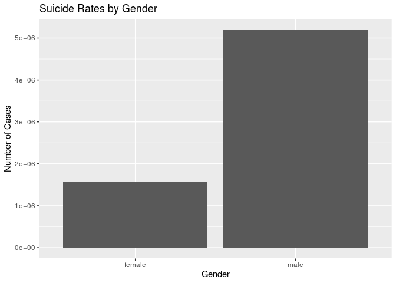
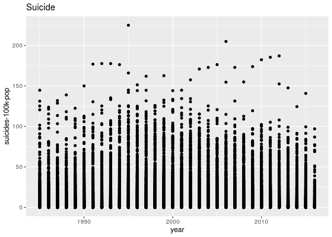
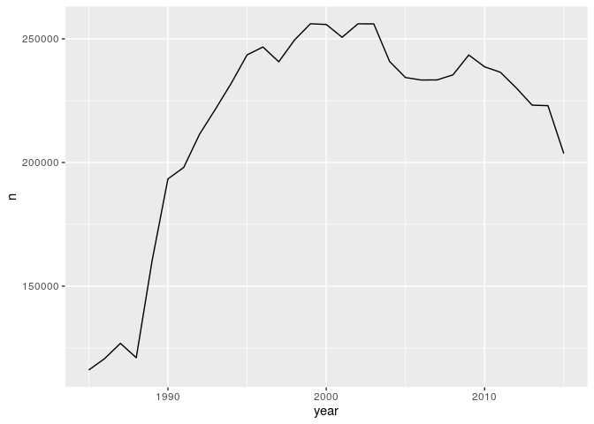

Project proposal
================
Team name

## 1\. Introduction

Whilst looking for a dataset for our project, we came across one about
suicides. This got us wondering about how suicide rates are influenced
by different variables. For our project we will be looking into how
suicides differ between genders, countries, and each year from 1985 to
2016. We will also compare the countries to other variables such as HDI
and gdp per capita, in order to extract valuable new information of what
affects the rates of suicide in each country.

Hypothesis: We suspect that countries with low gdp per capita and low
Human Development Index will have high levels of suicide. We also think
that men will have higher suicide rates than women.

The data was collected from kaggle and uses data from the United Nations
Development Program. (2018). Human development index (HDI). Retrieved
from <http://hdr.undp.org/en/indicators/137506>; World Bank. (2018).
World development indicators: GDP (current US$) by country:1985 to 2016.
Retrieved from
<http://databank.worldbank.org/data/source/world-development-indicators#>
; \[Szamil\]. (2017). Suicide in the Twenty-First Century \[dataset\].
Retrieved from
<https://www.kaggle.com/szamil/suicide-in-the-twenty-first-century/notebook>
; World Health Organization. (2018). Suicide prevention. Retrieved from
<http://www.who.int/mental_health/suicide-prevention/en/>. The cases are
the 101 countries from which the data was collected. And the variables:
year, sex, age, number of suicide, population, number of suicides by one
hundred thousand people of the population of each country, the HDI of
each country in the years that the data was collected and the GDP of
each country in each year, GDP per capita in each year for each country
and the generation.

``` r
library(tidyverse)
library(broom)
library(readr)
library(forcats)
suicides <- read_csv("master.csv")
view(suicides)
```

## 2\. Data

``` r
suicides <- read_csv("master.csv")
glimpse(suicides)
```

    ## Rows: 27,820
    ## Columns: 12
    ## $ country              <chr> "Albania", "Albania", "Albania", "Albania", "Alb…
    ## $ year                 <dbl> 1987, 1987, 1987, 1987, 1987, 1987, 1987, 1987, …
    ## $ sex                  <chr> "male", "male", "female", "male", "male", "femal…
    ## $ age                  <chr> "15-24 years", "35-54 years", "15-24 years", "75…
    ## $ suicides_no          <dbl> 21, 16, 14, 1, 9, 1, 6, 4, 1, 0, 0, 0, 2, 17, 1,…
    ## $ population           <dbl> 312900, 308000, 289700, 21800, 274300, 35600, 27…
    ## $ `suicides/100k pop`  <dbl> 6.71, 5.19, 4.83, 4.59, 3.28, 2.81, 2.15, 1.56, …
    ## $ `country-year`       <chr> "Albania1987", "Albania1987", "Albania1987", "Al…
    ## $ `HDI for year`       <dbl> NA, NA, NA, NA, NA, NA, NA, NA, NA, NA, NA, NA, …
    ## $ `gdp_for_year ($)`   <dbl> 2156624900, 2156624900, 2156624900, 2156624900, …
    ## $ `gdp_per_capita ($)` <dbl> 796, 796, 796, 796, 796, 796, 796, 796, 796, 796…
    ## $ generation           <chr> "Generation X", "Silent", "Generation X", "G.I. …

## 3\. Data analysis plan

``` r
suicides %>% 
  group_by(country) %>% 
  summarise(n = sum(suicides_no))
```

    ## `summarise()` ungrouping output (override with `.groups` argument)

    ## # A tibble: 101 x 2
    ##    country                 n
    ##    <chr>               <dbl>
    ##  1 Albania              1970
    ##  2 Antigua and Barbuda    11
    ##  3 Argentina           82219
    ##  4 Armenia              1905
    ##  5 Aruba                 101
    ##  6 Australia           70111
    ##  7 Austria             50073
    ##  8 Azerbaijan           1656
    ##  9 Bahamas                93
    ## 10 Bahrain               463
    ## # … with 91 more rows

``` r
suicides %>% 
  group_by(year) %>% 
  summarise(n = sum(suicides_no)) %>% 
  summarise(mean = mean(n))
```

    ## `summarise()` ungrouping output (override with `.groups` argument)

    ## # A tibble: 1 x 1
    ##      mean
    ##     <dbl>
    ## 1 210888.

``` r
suicides %>% 
  group_by(sex) %>% 
  summarise(n = sum(suicides_no)) %>% 
  ggplot(aes(x = sex, y = n)) + 
  geom_col() +
  labs(title = "Suicide Rates by Gender",
       x = "Gender",
       y = "Number of Cases")
```

    ## `summarise()` ungrouping output (override with `.groups` argument)

<!-- -->

``` r
suicides %>% 
  group_by(generation) %>% 
  summarise(n = sum(suicides_no)) %>% 
  ggplot(aes(x = generation, y = n)) + 
  geom_col()
```

    ## `summarise()` ungrouping output (override with `.groups` argument)

<!-- -->

``` r
suicides %>% 
  group_by(year) %>% 
  summarise( n = sum(suicides_no)) %>% 
  filter(year < 2016) %>% 
  ggplot(aes(x = year, y = n)) + 
  geom_line() 
```

    ## `summarise()` ungrouping output (override with `.groups` argument)

<!-- -->
