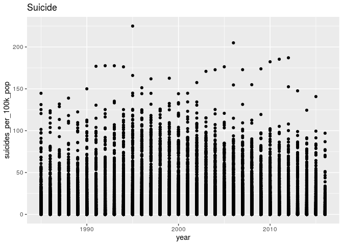
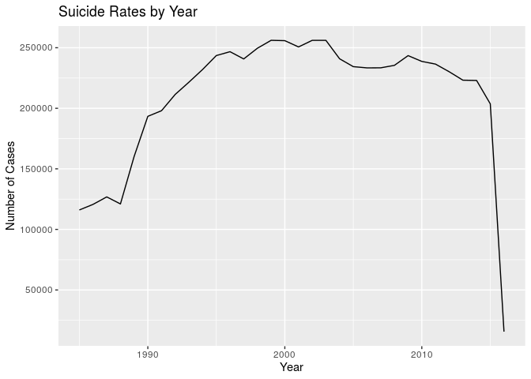

Project proposal
================
Tutorial 3 Team 10

## 1\. Introduction

Whilst looking for a dataset for our project, we came across one about
suicides. This got us wondering about how suicide rates are influenced
by different variables. For our project we will be looking into how
suicides differ between genders, countries, and each year from 1985 to
2016. We will also compare the countries to other variables such as HDI
and gdp per capita, in order to extract valuable new information of what
affects the rates of suicide in each country.

Hypothesis: We suspect that countries with low gdp per capita and low
Human Development Index will have high levels of suicide. We also think
that men will have higher suicide rates than women.

The data was collected from kaggle and uses data from the United Nations
Development Program. (2018). Human development index (HDI). Retrieved
from <http://hdr.undp.org/en/indicators/137506>; World Bank. (2018).
World development indicators: GDP (current US$) by country:1985 to 2016.
Retrieved from
<http://databank.worldbank.org/data/source/world-development-indicators#>
; \[Szamil\]. (2017). Suicide in the Twenty-First Century \[dataset\].
Retrieved from
<https://www.kaggle.com/szamil/suicide-in-the-twenty-first-century/notebook>
; World Health Organization. (2018). Suicide prevention. Retrieved from
<http://www.who.int/mental_health/suicide-prevention/en/>. The
observations are the number of suicides that fall into each category of
gender, age group, country and year. There are in total 27,280
observations spanning 101 countries and 31 years. The variables are:
year, sex, age, number of suicides, population, number of suicides per
one hundred thousand people, the HDI (Human Development Index) of each
country, the GDP of each country, the GDP per capita of each country and
the generation of the victims.

``` r
library(tidyverse)
library(broom)
library(readr)
library(forcats)
suicides <- read_csv("../data/master.csv")
```

## 2\. Data

``` r
glimpse(suicides)
```

    ## Rows: 27,820
    ## Columns: 12
    ## $ country              <chr> "Albania", "Albania", "Albania", "Albania", "Alb…
    ## $ year                 <dbl> 1987, 1987, 1987, 1987, 1987, 1987, 1987, 1987, …
    ## $ sex                  <chr> "male", "male", "female", "male", "male", "femal…
    ## $ age                  <chr> "15-24 years", "35-54 years", "15-24 years", "75…
    ## $ suicides_no          <dbl> 21, 16, 14, 1, 9, 1, 6, 4, 1, 0, 0, 0, 2, 17, 1,…
    ## $ population           <dbl> 312900, 308000, 289700, 21800, 274300, 35600, 27…
    ## $ `suicides/100k pop`  <dbl> 6.71, 5.19, 4.83, 4.59, 3.28, 2.81, 2.15, 1.56, …
    ## $ `country-year`       <chr> "Albania1987", "Albania1987", "Albania1987", "Al…
    ## $ `HDI for year`       <dbl> NA, NA, NA, NA, NA, NA, NA, NA, NA, NA, NA, NA, …
    ## $ `gdp_for_year ($)`   <dbl> 2156624900, 2156624900, 2156624900, 2156624900, …
    ## $ `gdp_per_capita ($)` <dbl> 796, 796, 796, 796, 796, 796, 796, 796, 796, 796…
    ## $ generation           <chr> "Generation X", "Silent", "Generation X", "G.I. …

## 3\. Data analysis plan

### Preliminary Data Analysis

To do data analysis first we must make sure our variables are named
correctly.

``` r
suicides <- suicides %>% 
  rename(hdi = 'HDI for year',
         suicides_per_100k_pop = 'suicides/100k pop',
         country_year = 'country-year',
         gdp ='gdp_for_year ($)',
         gdp_per_capita = 'gdp_per_capita ($)') 
```

``` r
suicides %>% 
  group_by(country) %>% 
  summarise(n = sum(suicides_no)) %>% 
  arrange(desc(n))
```

    ## `summarise()` ungrouping output (override with `.groups` argument)

    ## # A tibble: 101 x 2
    ##    country                  n
    ##    <chr>                <dbl>
    ##  1 Russian Federation 1209742
    ##  2 United States      1034013
    ##  3 Japan               806902
    ##  4 France              329127
    ##  5 Ukraine             319950
    ##  6 Germany             291262
    ##  7 Republic of Korea   261730
    ##  8 Brazil              226613
    ##  9 Poland              139098
    ## 10 United Kingdom      136805
    ## # … with 91 more rows

First we summed the total suicides by country to see which country had
the greatest number of suicides in the dataset.This turned out to be the
Russian Federation. However this does not tell us much about suicide
rates as it doesn’t take into account the population of the country. In
the next code chunk we will sum the total number of suicides per 100000
population to see which country has the highest suicide rates.

``` r
suicides %>% 
  group_by(country) %>% 
  summarise(n = sum(suicides_per_100k_pop)) %>% 
  arrange(desc(n))
```

    ## `summarise()` ungrouping output (override with `.groups` argument)

    ## # A tibble: 101 x 2
    ##    country                 n
    ##    <chr>               <dbl>
    ##  1 Russian Federation 11305.
    ##  2 Lithuania          10589.
    ##  3 Hungary            10156.
    ##  4 Kazakhstan          9520.
    ##  5 Republic of Korea   9350.
    ##  6 Austria             9076.
    ##  7 Ukraine             8932.
    ##  8 Japan               8025.
    ##  9 Finland             7924.
    ## 10 Belgium             7900.
    ## # … with 91 more rows

It seems that Russia also has the highest total number of suicides per
100000 people in the 30 years. However the next highest is Lithuania
which has a small population but a high level of suicide. These two
countries are close geographically. The top three countries, Russia,
Lithuania and Hungary are all close geographically. This is something we
will be exploring more later on.

In our next plot we test one of our hypotheses. Do more men commit
suicide than women?

``` r
suicides %>% 
  group_by(sex) %>% 
  summarise(n = sum(suicides_no)) %>% 
  ggplot(aes(x = sex, y = n)) + 
  geom_col() +
  labs(title = "Suicide Rates by Gender",
       x = "Gender",
       y = "Number of Cases")
```

    ## `summarise()` ungrouping output (override with `.groups` argument)

<!-- -->

``` r
suicides %>%
  group_by(year) %>%
  ggplot(aes(x = year, y = suicides_per_100k_pop)) +
  geom_point() +
  labs(title = "Suicide")
```

<!-- -->

This graph shows our hypothesis is correct, there is a massive
discrepancy with over three times more male suicides than female.

Our final plot compares the total number of suicides for each year.

``` r
suicides %>% 
  group_by(year) %>% 
  summarise( n = sum(suicides_no)) %>% 
  ggplot(aes(x = year, y = n)) + 
  geom_line() +
  labs(title = "Suicide Rates by Year",
       x = "Year",
       y = "Number of Cases")
```

    ## `summarise()` ungrouping output (override with `.groups` argument)

<!-- -->

The value for 2016 is extremely low. This suggests that the data for
2016 is incomplete so we should ignore this. Suicide rates were highest
around the late 1990s, early 2000s. There is also a increase around
2008/ 2009. One possible contributor to this is the 2008 financial
crash.

One of our main goals will be trying to find the relationship between a
countries general standard of living and the rate of suicide. The
predictor variable will be the HDI and the outcome variable will be
average number of suicides per 100000 people per year for a country.
Other explanatory variable such as gdp per capita and levels of
inequality could be explored.

One important statistical method we will try to use is a heat map, as we
believe it will be a useful tool for displaying data on countries across
the world. A heat map could also be used to see levels of poverty and
inequality across the world. If the heat maps show similar patterns it
will support our hypothesis. Another statistical method is to analyze
the line graph of suicides per year filtered for certain countries. This
could be compared to the timeline of potentially relevant events that
the country has been through to see if they had any effect.
